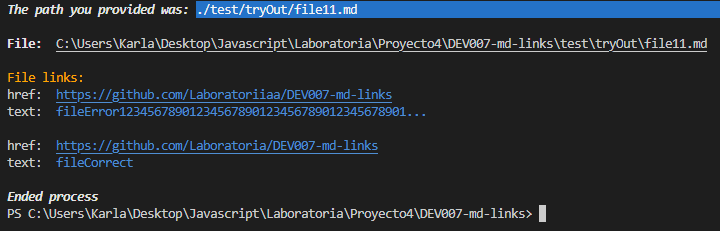
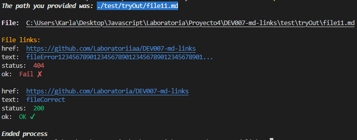
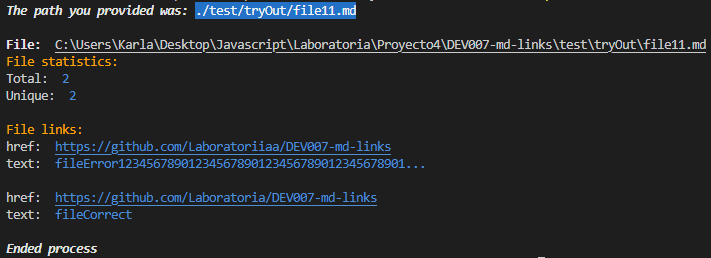
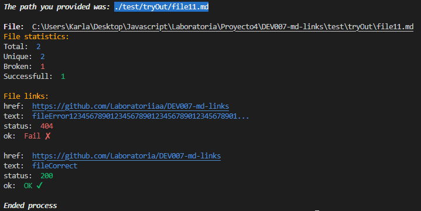
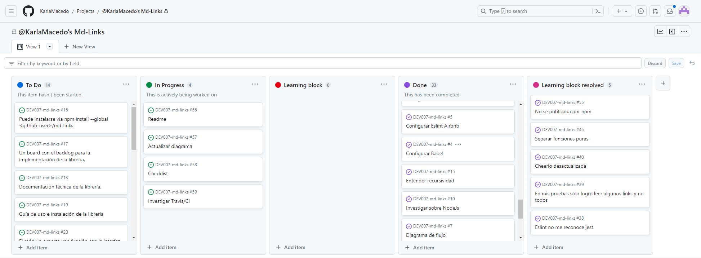
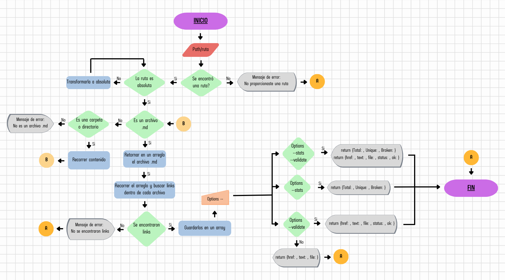

# Markdown Links

## Index

* [1. Introduction](#1-introduction)
* [2. Project Summary](#2-project-summary)
* [3. General Considerations](#3-general-considerations)
* [4. Usage Instructions](#4-usage-instructions)
* [5. Project Planning](#5-project-planning)
* [6. Learning Objectives](#6-learning-objectives)


***

## 1. Introduction

[Markdown](https://es.wikipedia.org/wiki/Markdown)  is a lightweight markup
 language widely used among developers. It is used in many platforms that 
 handle plain text (such as GitHub, forums, blogs, etc.), and it is common
 to find multiple files in that format in any type of repository (starting
 with the traditional `README.md` file).

These `Markdown` files often contain _links_  that are sometimes broken or
 no longer valid, which greatly diminishes the value of the shared information.

Within an open-source community, we have been tasked with creating a tool using
 [Node.js](https://nodejs.org/) that reads and analyzes `Markdown` files, verifies
 the links they contain, and reports some statistics.

## 2. Project Summary

This project is a command-line tool (CLI) / JavaScript library that is executed
 using Node.js.

[Node.js](https://nodejs.org/es/) is a runtime environment for JavaScript built
 on the [Chrome V8 JavaScript engine](https://developers.google.com/v8/).
 It allows running JavaScript in the operating system environment, either on a
 machine or a server, opening the doors to interact with the system itself, files,
 networks, etc.

## 3. General Considerations

* This project was completed individually.

* The estimated time range to complete the project was 4 to 5 Sprints, and it was
 completed in 2.5 Sprints.

* Compatibility was verified in the **Linux, Mac and Windows** execution environments.

* The **library**  and the **executable script** (command-line tool - CLI) are 
implemented in JavaScript to be run with Node.js. **External libraries like path, FS,**
**Axios, JSDOM, chalk, and marked were used**.

* The module is **installable** via `npm install karlamac-md-links`. 

* For this project, the use of `async/await` was **not allowed**.

* The asynchronous version was used to read files.

* ES Modules `(import/export)` were used with the help of **babel**.

* To **reduce the complexity** of the recursive algorithm, the synchronous version of
 the function to read directories, `readdirSync`, was used.

## 4. Usage Instructions

### Installation

To install the library, run the following command in the terminal:

```
npm install karlamac-md-links
```

### Usage in the Terminal

To use the library through the terminal, use the following command:

```
npx karlamac-md-links <path-to-file> [options]
```

Replace `<path-to-file>` with the path (absolute or relative) of the file or directory 
you want to process. Replace `[options]` with the action you want to perform:

#### Options

If no options are provided (`npx karlamac-md-links <path-to-file>`),  it will return the
 .md files found and the links contained within each file. If no links or files are found,
 a notification will be displayed.



If only the `--valid` option is provided (`npx karlamac-md-links <path-to-file> --valid`),
 it will return the .md files found, the links contained within each file, and validate 
 them through an HTTP request. It will also return their status codes, displaying an "OK ✔"
 notification for successful requests and a "Fail ✘" notification otherwise. If no links or
 files are found, a notification will be displayed.



If only the `--stats` option is provided (`npx karlamac-md-links <path-to-file> --stats`),
 it will return the .md files found and the links contained within each file. If no links
 or files are found, a notification will be displayed. Additionally, it will display a 
 statistics section showing the total number of links found in the search and how many of
 them are unique.



If the `--valid` and `--stats` options are provided (`npx karlamac-md-links <path-to-file> --valid --stats`),
 it will return the .md files found, the links contained within each file, validate them 
 through an HTTP request, and display their status codes with an "OK ✔" notification for
 successful requests and a "Fail ✘" notification otherwise. If no links or files are found,
 a notification will be displayed. Additionally, it will display a statistics section showing
 the total number of links found in the search, how many of them are unique, how many were
 successful in the HTTP request, and how many were not.



### Usage as an API

To use the library as an API (Application Programming Interface), follow these steps:

- Fork the [GitHub repository](https://github.com/KarlaMacedo/DEV007-md-links).

- Open your terminal and navigate to the location where you want to save the project using
 the `cd` command. 

- Run the following command:
```
git clone https://github.com/KarlaMacedo/DEV007-md-links.git
```

- Open the project folder in your preferred code editor.

- Open the terminal and execute the project using the following commands, depending on the
 desired action:

#### Opciones

If no options are provided (`node cli.js <path-to-file>`),  it will return the .md files found
 and the links contained within each file. If no links or files are found, a notification will
 be displayed.


If only the `--valid` option is provided (`node cli.js <path-to-file> --valid`), it will return
 the .md files found, the links contained within each file, and validate them through an HTTP 
 request. It will also return their status codes, displaying an "OK ✔" notification for successful
 requests and a "Fail ✘" notification otherwise. If no links or files are found, a notification 
 will be displayed.


If only the `--stats` option is provided (`node cli.js <path-to-file> --stats`), it will return the
 .md files found and the links contained within each file. If no links or files are found, a 
 notification will be displayed. Additionally, it will display a statistics section showing the total
 number of links found in the search and how many of them are unique.


If the `--valid` and `--stats` options are provided (`node cli.js <path-to-file> --valid --stats`), 
it will return the .md files found, the links contained within each file, validate them through an HTTP
 request, and display their status codes with an "OK ✔" notification for successful requests and a 
 "Fail ✘" notification otherwise. If no links or files are found, a notification will be displayed.
 Additionally, it will display a statistics section showing the total number of links found in the search,
 how many of them are unique, how many had successful HTTP requests, and how many had failed requests.


## 5. Project Planning

This project was planned using [GitHub Projects](https://docs.github.com/en/issues/planning-and-tracking-with-projects/learning-about-projects/about-projects), creating issues, labels, and milestones.



A flowchart was also previously created as a guide for the development of the logic of the project.




## 6. Learning Objectives

### JavaScript

- [✓] **Distinguish between primitive and non-primitive data types**

- [✓] **Arrays**

  <details><summary>Links</summary><p>

  * [Arreglos](https://curriculum.laboratoria.la/es/topics/javascript/04-arrays)
  * [Array - MDN](https://developer.mozilla.org/es/docs/Web/JavaScript/Reference/Global_Objects/Array/)
  * [Array.prototype.sort() - MDN](https://developer.mozilla.org/es/docs/Web/JavaScript/Reference/Global_Objects/Array/sort)
  * [Array.prototype.forEach() - MDN](https://developer.mozilla.org/es/docs/Web/JavaScript/Reference/Global_Objects/Array/forEach)
  * [Array.prototype.map() - MDN](https://developer.mozilla.org/es/docs/Web/JavaScript/Reference/Global_Objects/Array/map)
  * [Array.prototype.filter() - MDN](https://developer.mozilla.org/es/docs/Web/JavaScript/Reference/Global_Objects/Array/filter)
  * [Array.prototype.reduce() - MDN](https://developer.mozilla.org/es/docs/Web/JavaScript/Reference/Global_Objects/Array/Reduce)
</p></details>

- [✓] **Objects (key, value)**

  <details><summary>Links</summary><p>

  * [Objetos en JavaScript](https://curriculum.laboratoria.la/es/topics/javascript/05-objects/01-objects)
</p></details>

- [✓] **Use of conditionals (if-else, switch, ternary operator, boolean logic)**

  <details><summary>Links</summary><p>

  * [Estructuras condicionales y repetitivas](https://curriculum.laboratoria.la/es/topics/javascript/02-flow-control/01-conditionals-and-loops)
  * [Tomando decisiones en tu código — condicionales - MDN](https://developer.mozilla.org/es/docs/Learn/JavaScript/Building_blocks/conditionals)
</p></details>

- [✓] **Functions (params, args, return)**

  <details><summary>Links</summary><p>

  * [Funciones (control de flujo)](https://curriculum.laboratoria.la/es/topics/javascript/02-flow-control/03-functions)
  * [Funciones clásicas](https://curriculum.laboratoria.la/es/topics/javascript/03-functions/01-classic)
  * [Arrow Functions](https://curriculum.laboratoria.la/es/topics/javascript/03-functions/02-arrow)
  * [Funciones — bloques de código reutilizables - MDN](https://developer.mozilla.org/es/docs/Learn/JavaScript/Building_blocks/Functions)
</p></details>

- [✓] **Recursion**

  <details><summary>Links</summary><p>

  * [Píldora recursión - YouTube Laboratoria Developers](https://www.youtube.com/watch?v=lPPgY3HLlhQ)
  * [Recursión o Recursividad - Laboratoria Developers en Medium](https://medium.com/laboratoria-developers/recursi%C3%B3n-o-recursividad-ec8f1a359727)
</p></details>

- [✓] **CommonJS Modules**

  <details><summary>Links</summary><p>

  * [Modules: CommonJS modules - Node.js Docs](https://nodejs.org/docs/latest/api/modules.html)
</p></details>

- [✓] **Distinguish between expressions and statements**

- [✓] **Callbacks**

  <details><summary>Links</summary><p>

  * [Función Callback - MDN](https://developer.mozilla.org/es/docs/Glossary/Callback_function)
</p></details>

- [✓] **Promises**

  <details><summary>Links</summary><p>

  * [Promise - MDN](https://developer.mozilla.org/es/docs/Web/JavaScript/Reference/Global_Objects/Promise)
  * [How to Write a JavaScript Promise - freecodecamp (en inglés)](https://www.freecodecamp.org/news/how-to-write-a-javascript-promise-4ed8d44292b8/)
</p></details>

- [✓] **Unit Testing**

  <details><summary>Links</summary><p>

  * [Empezando con Jest - Documentación oficial](https://jestjs.io/docs/es-ES/getting-started)
</p></details>

- [✓] **Asynchronous Testing**

  <details><summary>Links</summary><p>

  * [Tests de código asincrónico con Jest - Documentación oficial](https://jestjs.io/docs/es-ES/asynchronous)
</p></details>

- [ ] **Use of Mocks and Spies**

  <details><summary>Links</summary><p>

  * [Manual Mocks con Jest - Documentación oficial](https://jestjs.io/docs/es-ES/manual-mocks)
</p></details>

- [ ] **Compatibility Testing in Multiple Execution Environments**

- [✓] **Use of linter (ESLint)**

- [✓] **Use of descriptive identifiers (Naming and Semantics)**

### Node.js

- [✓] **Install and Use Modules with npm**

  <details><summary>Links</summary><p>

  * [Sitio oficial de npm (en inglés)](https://www.npmjs.com/)
</p></details>

- [✓] **Package.json Configuration**

  <details><summary>Links</summary><p>

  * [package.json - Documentación oficial (en inglés)](https://docs.npmjs.com/files/package.json)
</p></details>

- [✓] **npm-scripts Configuration**

  <details><summary>Links</summary><p>

  * [scripts - Documentación oficial (en inglés)](https://docs.npmjs.com/misc/scripts)
</p></details>

- [✓] **process (env, argv, stdin-stdout-stderr, exit-code)**

  <details><summary>Links</summary><p>

  * [Process - Documentación oficial (en inglés)](https://nodejs.org/api/process.html)
</p></details>

- [✓] **File system (fs, path)**

  <details><summary>Links</summary><p>

  * [File system - Documentación oficial (en inglés)](https://nodejs.org/api/fs.html)
  * [Path - Documentación oficial (en inglés)](https://nodejs.org/api/path.html)
</p></details>

### Version Control (Git y GitHub)

- [✓] **Git: Installation and Configuration**

- [✓] **Git: Version Control with Git (init, clone, add, commit, status, push, pull, remote)**

- [✓] **Git: Integration of Changes Between Branches (branch, checkout, fetch, merge, reset, rebase, tag)**

- [✓] **GitHub: Account Creation and Repositories, SSH Key Configuration**

- [✓] **GitHub: Collaboration on Github (branches | forks | pull requests | code review | tags)**

- [✓] **GitHub: Organization on Github (projects | issues | labels | milestones | releases)**

### HTTP

- [✓] **Request and Response**

  <details><summary>Links</summary><p>

  * [Generalidades del protocolo HTTP - MDN](https://developer.mozilla.org/es/docs/Web/HTTP/Overview)
  * [Mensajes HTTP - MDN](https://developer.mozilla.org/es/docs/Web/HTTP/Messages)
</p></details>

- [✓] **HTTP Status Codes**

  <details><summary>Links</summary><p>

  * [Códigos de estado de respuesta HTTP - MDN](https://developer.mozilla.org/es/docs/Web/HTTP/Status)
  * [The Complete Guide to Status Codes for Meaningful ReST APIs - dev.to](https://dev.to/khaosdoctor/the-complete-guide-to-status-codes-for-meaningful-rest-apis-1-5c5)
</p></details>

